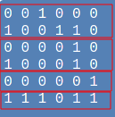
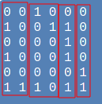
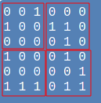

# Game Of Life, MPI Implementation
Corso di Programmazione Concorrente e Parallela Su Cloud, Dipartimento di Informatica, Università degli Studi di Salerno

-Name: Gilberto Recupito , 0522500842


# Installazione
Il seguente progetto presenta le seguenti versioni:

 - **gol_animation.c** : esecuzione della versione animata semplice di Game Of Life
 - **gol_correctness.c** : esecuzione della versione che stampa ogni generazione per la verifica di correttezza di Game Of Life
 - **gol.c** : esecuzione della versione che misura le prestazioni di scalabilità debole e forte di Game Of Life
 - **gol_misuring.c** : esecuzione della versione che misura e salva su file le prestazioni di scalabilità debole e forte di Game Of Life(utilizzabile anche attraverso Makefile)

Per l'esecuzione del progetto è necessario eseguire le seguenti righe di comando:

- gol_animation.c:

```
mpicc gol_animation.c -o animation

mpirun -np <X> animation <N> <M> <G>
```

- gol_correctness.c:

```
mpicc gol_correctness.c -o correctness

mpirun -np <X> correctness <N> <M> <G>
```
- gol.c :

```
mpicc gol.c -o gol

mpirun -np <X> gol <N> <M> <G>
```
- gol_misuring.c :

```
mpicc gol_misuring.c -o gol_misuring

mpirun -np <X> gol <N> <M> <G> <FILE>
```  

I parametri rappresentati sono i seguenti:
- X: Numero di processi
- N: Numero di righe della matrice
- M: Numero di colonne della matrice
- G: Numero di generazioni
- FILE: nome del file su cui scrivere i risultati

# Game Of Life: Indice di Progettazione
La soluzione proposta per la realizzazione di questo progetto prevede principalmente la risoluzione attraverso i seguenti step:

1. Creazione, Suddivisione e scattering della matrice:

2. Computazione di ogni singolo processo di ogni riga interna

3. Comunicazione delle righe esterne tra i processi e Computazione delle righe esterne

4. Gathering della matrice


## 1. Creazione, Suddivisione e scattering della matrice

### Creazione

La creazione della matrice è stata effettuata dal processo Master è utilizza la seguente struttura per la definizione di essa:

```
//Matrix world creator for Game of Life in MPI
typedef struct {
    char * matrix;
    int rows;
    int columns;
}Pworld;

```
**Problema affrontato : Allocazione della matrice**
In questo caso la matrice poteva essere definita come un array di puntatori dove ogni puntatore puntava a un array di caratteri. Questa proposta di soluzione riportava problemi successivi relativi alla comunicazione delle righe tra i processi, poichè l'allocazione delle righe non erano contigue tra loro e risalire alla posizione della riga successiva era risultato più complicato.
Per risolvere questo problema si è pensato di allocare la memoria della matrice contiguamente definendo quindi un array di rows*columns elementi.
Una volta creata la relazione tra quella che è la posizione della matrice e la posizione fisica nell'array è la seguente:

```
 Sia A una matrice e B l'array corrispondente entrambi di n*m elementi
 A[i][j] = B[(i*m)+j]
```

Una volta definita la struttura di tipo Pworld, il master creerà la matrice attraverso la seguente funzione:

```
Pworld* create_world(int n,int m);
```

L'inizializzazione della matrice avviene in maniera pseudocasuale attraverso la funzione init_world:

```
void init_world(Pworld * p,int seed)
```

Dove p rappresenta il mondo da inizializzare e seed il seme per la funzione di randomizzazione (rand())

### Suddivisione 

**Problema Affrontato: Suddivisione della matrice** 
Questo problema principalmente presenta la suddivisione della matrice in sottomatrici da distribuire ai diversi processi. 
Tra le soluzioni proposte le più rilevanti e analizzate sono state:


1. Per righe



2. Per colonne



3. Per sottomatrici




Per le tecniche 1 e 2 dobbiamo considerare la prima e l'ultima riga di ogni partizione distribuita come una riga esterna (ghost row), poichè serviranno ai processi adiacenti per effettuare completamente la computazione. Considerando quindi che ogni processo i quindi dovrà inviare una riga al processo i-1 e una riga al processo i+1 , avremmo per ogni generazione 2*p righe inviate.

Per la tecnica 3 invece dobbiamo considerare che per ogni cella nel bordo dobbiamo ricevere fino a 3 messaggi da 3 differenti processi, e in alcuni casi fino a 4 messaggi da 4 diversi processi.

Per questo motivo, al fine di ridurre l'overhead di comunicazione tra i processi, si è deciso di utilizzare una delle prime due tecniche.

In particolare, utilizzando C come linguaggio si è deciso di utilizzare la suddivisione per righe (1), poichè per la gestione dell'allocazione di memoria C presenta un orientamento di tipo row major.

### Scattering
Per la suddivisione della matrice è stata utilizzata il pattern di comunicazione **Scatter**, in particolare la funzione MPI_Scatterv(), dove nel nostro contesto, a differenza della classica funzione Scatter, ci permette di decidere quante righe inviare ad ogni processo.

```
MPI_Scatterv(p->matrix,sendcounts,displs,row,p->matrix,recv_count,row,0,MPI_COMM_WORLD)
```
In particolare vengono calcolate le posizioni iniziali (displs) da cui partire per ogni invio di riga, e la quantità di righe da inviare ad ogni processore, distribuendo omogeneamente una riga per ogni processore nel caso il numero di righe non è divisibile per il numero di processori.
Per una migliore e più semplice suddivisione della matrice, è stato deciso di creare il datatype di comunicazione *row*, e di utilizzarlo per tutte le operazioni di comunicazione tra i processi:

```
MPI_Type_contiguous(m,MPI_CHAR,&row);
```

Dato che la matrice è stata allocata contiguamente, è stato deciso di definire un datatype contiguo.


## 2. Computazione di ogni singolo processo di ogni riga interna

Dopo che ogni processo riceve la sua partizione di matrice, è necessario analizzare la partizione secondo le seguenti definizioni:

- **Riga limite superiore:** prima riga del processo i per il quale ogni elemento presente in questa riga ha bisogno dell'ultima riga del processo i-1.

- **Riga interna:** riga del processo i per il quale ogni elemento presente in questa riga non ha bisogno di righe presenti in altri processi per la computazione della generazione.

- **Riga limite inferiore:** prima riga del processo i per il quale ogni elemento presente in questa riga ha bisogno della prima riga del processo i+1.

Data questa differenziazione di righe, si è preferito che ogni processo computasse inizialmente le righe interne per poi passare alla computazione.

Facendo riferimento alla funzione compute() che comprende tutta la fase di computazione e comunicazione, calcoliamo inizialmente l'elemento della generazione successiva attraverso le seguenti funzioni:

```
int count_internalrow(Pworld * p, int n, int m);
int count_externalrow(Pworld * p, int n, int m);
```

- **count_internalrow:** conta il numero di celle vicine per la riga attuale rispetto alla cella (n,m)
- **count_externalrow:** conta il numero di celle vicine per la riga superiore o inferiore rispetto alla cella (n,m)

In riferimento a questi due metodi, il calcolo della condizione sul conteggio delle celle vive poi viene effettuato attraverso la funzione alive_conditioner()

```
char alive_conditioner(char cell,int count){
    if(isAlive(cell)){
        if(count<2||count>3){
            return '0';
        }else{
            return '1';
        }
    }else{
        if(count==3){
            return '1';
        }else{
            return '0';
        }
    }
}
```
Quindi per ogni cella j di ogni sottomatrice compresa tra gli indici di riga 1 e rows-2 utilizzano il seguente snippet per il calcolo della generazione successiva:
```
for(int i=1;i<p->rows-1;i++){
    for(int j=0;j<p->columns;j++){

        //starting to count the nearest cells
        int count=0;

        //count alive cells in upper row
        count+=count_externalrow(p,i-1,j);
                
        //count alive cells in current row (need to not consider the current cell)
        count+=count_internalrow(p,i,j);

        //count alive cells in lower row
        count+=count_externalrow(p,i+1,j);
                
        //update cell
        updated_world->matrix[(p->columns*i)+j] = alive_conditioner(p->matrix[(p->columns*i)+j],count);
    }
}
```

## 3. Comunicazione tra i processi e computazione delle righe esterne

Avendo effettuato una suddivisione della matrice per righe, ogni processo ha bisogno della riga inferiore e della riga superiore rispetto alla sottomatrice attuale. Definiamo quindi:

-   **top_ghostrow:** come la riga del processo i-1 necessaria come riga superiore alla sottomatrice attuale

-   **bottom_ghostrow:** come la riga del processo i+1 necessaria come riga inferiore alla sottomatrice attuale

Quindi ogni processo dovrà inviare corrispettivamente la prima e l'ultima riga della sua sottomatrice rispettivamente al processo i-1 e al processo i+1;

Il processo principalmente prevede i seguenti step:
- **Invio non bloccante della riga superiore e inferiore**
- **Computazione delle righe interne**
- **Ricezione bloccante delle ghost rows e computazione delle righe esterne della matrice**

Questa operazione è stata realizzata attraverso i metodi send_up() and send_down()
Per questa operazione è stato deciso di utilizzare un invio non bloccante in modo che non bisogna aspettare il completamento per continuare la computazione.
```

/** Permit to send the communication row to the process above */
MPI_Request send_up(Pworld * p,int rank,MPI_Datatype* row,int p_size){
   int rank_tosend;
   if(Master(rank)){
       rank_tosend=p_size-1;
   }else{
       rank_tosend=rank-1;
   }
   MPI_Request r;
   MPI_Isend(&(p->matrix[0]),1,*row,rank_tosend,14,MPI_COMM_WORLD,&r);
   return r;
}

/** Permit to send the communication row to the process below**/
MPI_Request send_down(Pworld * p,int rank,MPI_Datatype* row,int p_size){

    MPI_Request r;
    MPI_Isend(&(p->matrix[(p->columns)*(p->rows-1)]),1,*row,(rank+1)%p_size,14,MPI_COMM_WORLD,&r);
    return r;
}
```

Essendo la struttura logica un toroide, è necessario definire come il processo precedente di 0 il processo n-1.

Analogamente, per la ricezione delle righe inviate dai processi adiacenti sono stati utilizzati i metodi receive_up() e receive_down():

```
/** Permit to receive the communication row from the process above**/
MPI_Request * receive_up(Pworld * p,int rank,MPI_Datatype* row,int p_size){
    int rank_toreceive;
    if(Master(rank)){
        rank_toreceive=p_size-1;
    }else{
        rank_toreceive=rank-1;
    }
    MPI_Request * r;
    MPI_Status s;
    MPI_Recv(&p->matrix[0],1,*row,rank_toreceive,14,MPI_COMM_WORLD,&s);
    return r;
}


/** Permit to receive the communication row from the process below**/
MPI_Request * receive_down(Pworld * p,int rank,MPI_Datatype* row,int p_size){
    int rank_tosend;
    if(Master(rank)){
        rank_tosend=p_size-1;
    }else{
        rank_tosend=rank-1;
    }
    MPI_Request * r;
    MPI_Status s;
    MPI_Recv(&p->matrix[0],1,*row,(rank+1)%p_size,14,MPI_COMM_WORLD,&s);
    return r;
}
```
Contrariamente all'invio, è necessario che le operazioni di receive siano completate per continuare la computazione. Per questo motivo si è deciso di utilizzare una receive bloccante.


## 4. Gathering della Matrice

Al termine della computazione le sottomatrici aggiornate saranno inviate tutte al processo Master.
Per effettuare questa operazione si è deciso di utilizzare l'operazione Gatherv:

```
MPI_Gatherv(&(updated_p->matrix[0]),sendcounts[rank],row,pointer_matrix_to_start,sendcounts,displs,row,0,MPI_COMM_WORLD);
```

L'array sendcounts e displs utilizzati sono analoghi a quelli utilizzati per l'operazione di Scatterv.

# Misurazione Scalabilità
Per l'esecuzione e la misurazione è stato riportato l'utilizzo del makefile in modo da automatizzare le diverse esecuzioni sul cluster di macchine utilzzate.
Nel contesto della misurazione sono state assegnate delle macchine di tipo t2.xlarge, quindi con 4 VCPU.
Quindi sono state utilizzate 4 macchine per avere a disposizione fino a 16 VCPUs.
## Scalabilità Forte


## Scalabilità Debole
